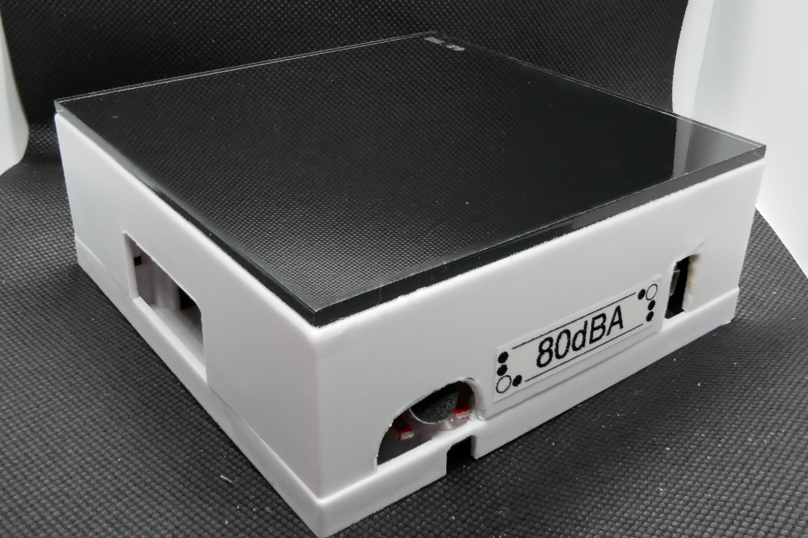
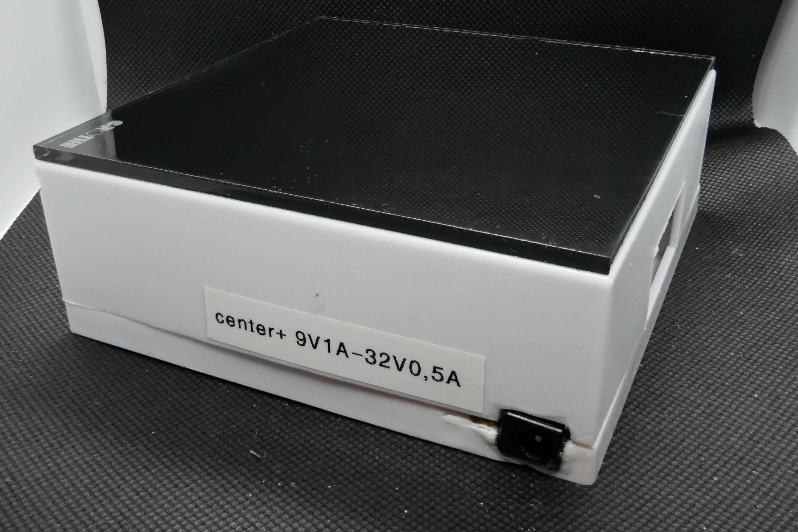
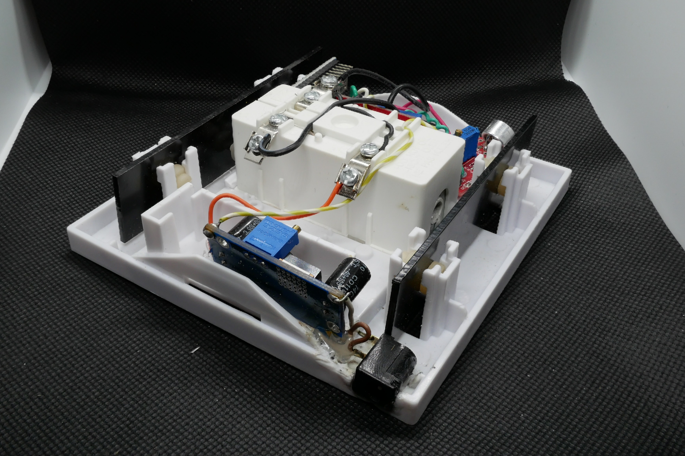
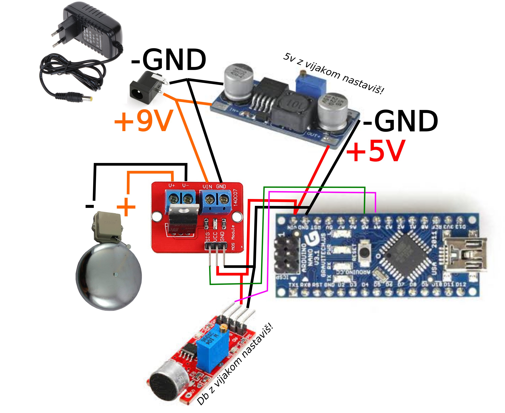

# DbA zvonček
## Napravica, ki zazvoni, ko je nastavljena glasnost prevečkrat prekoračena v določenem časovnem razponu

 Potrebuješ: 

* 12V hišni zvonček
* Ardino Nano
* MOS modul
* "senozor" za zvok
* DC Regulator napetosti 12V -> 5V
* 220->12V napajalnik

 
 
 
 
 
 